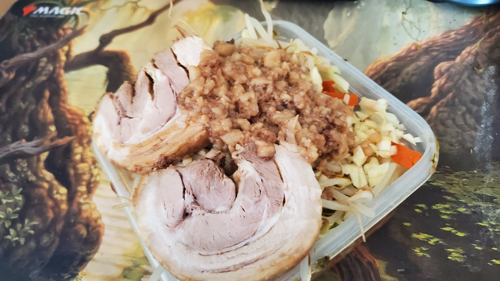

大学時代、もみじやという富士丸系のラーメン屋で育ったので
一月に一回は富士丸系が食べられない死ぬ病にかかっているので購入。

家に丼がないことに気づかない痛恨のミスを犯してしまい、ジップロックコンテナで
ごまかした。

この方法は完全に愚行であり、熱がどんどん逃げていくのでスープや麺が微妙にぬるくなってしまい美味しさが半減してしまった。本当に後悔している。
まだ二食分のこっているのでちゃんと丼を買って再挑戦したい。 
 
失敗したとはいえ、アブラとにんにくがのったヤサイの旨さは満足できるものであり、スープも味自体はかなり本格的でこれからの本格再現に期待の持てる内容であった。  
以上レポっす。
